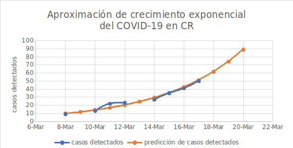
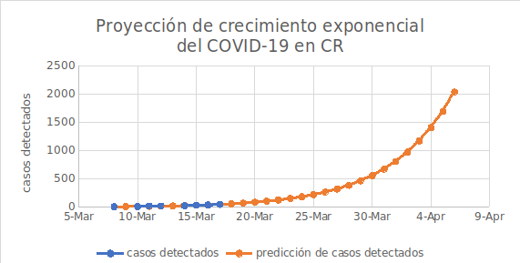
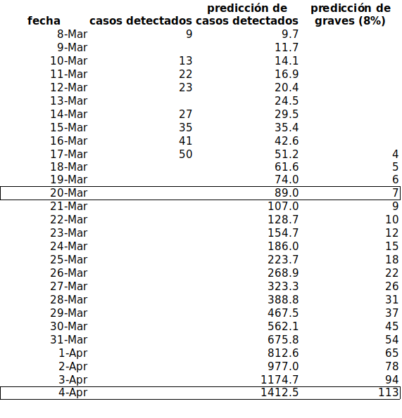

# Evolución esperada del COVID-19 en Costa Rica entre marzo y abril del 2020
## Una simple pero creíble predicción

Hice unos cálculos sencillos de la tendencia que llevamos con el COVID-19 en CR.

Mis supuestos son estos:
* el virus se propaga exponencialmente
* el comportamiento de la sociedad costarricense de los últmos días se mantiene en los siguientes días (donde muchas personas no siguen las recomendaciones dadas de higiene, distancia social y otras prevenciones)
* el estado sigue en capacidad de hacer los exámenes clínicos que corresponden a como va diseminándose el virus
* la proporción de enfermos graves se mantiene en un 8%

La curva de abajo aproxima la tendencia de crecimiento mostrada por los datos acumulados hasta el día 17 de marzo.

 

 
 

Si proyectamos esta tendencia 20 días hacia adelante, obtenemos el segundo gráfico.

 

 
 

En otras palabras, si seguimos como vamos, para el 6 de abril tendríamos 2042 casos detectados, y un 8%, o sea 163 personas estarían en situación delicada.

O sea, ¡hay que ponerse las pilas para evitar los contactos!

Cuando uno está en la cumbre de una montaña rusa, a punto de bajar en una cuesta extrema, se asusta a pesar de estar casi quieto. Creo que nuestra sociedad no ha reaccionado por que se siente a baja velocidad y no ha tenido disponible una imagen de hacia donde nos dirigimos. Pero ¡la alta velocidad está a punto de comenzar! Tenemos que quedarnos en la casa para bajar esa velocidad y permitir a nuestro sistema de salud seguir funcionando.

## En números concretos
Así se vería la proyección anterior en forma tabular.

Los primeros tres días hacia adelante nos dan una idea de la exactitud de la predicción.

Las filas siguientes, de la consecuencias si no cambiamos nuestros comportamientos como sociedad.

 

## Método empleado
Para los interesados, las hojas de cálculo adjuntas, en formato excel o en formato abierto, muestran como se hizo la proyección.

No hice nada muy complicado.

Simplemente supuse que el crecimiento sería exponencial (como se ha visto en la mayoría de los países y como normalmente se propagan las epidemias) y calculé la tasa de crecimiento exponencial.

El resto fue simplemente extender la curva según la cantidad de días transcurridos.

Lo mismo, en términos más técnicos:
1. calculé el ln() de los datos hasta la fecha
2. calculé una regresión lineal sobre esa serie
3. usé la regresión para proyectar predicciones a futuro
4. apliqué exp() para obtener los pronósticos en la unidades originales.

La proyección supone que la población en el país es infinita y que por ello el contagio no se va a detener.  Esto es aplicable, por supuesto, para tan solo las primeras semanas.  Eventualmente habrá factores atenuantes que hagan que la curva cambie de dirección y disminuyan sus valores.

Mi intención con esto es lograr concientizar a la población de que tan rápidamente pueden aumentarse los casos si no se obedecen las instrucciones que hemos recibido de las autoridades para reducir los contagios.